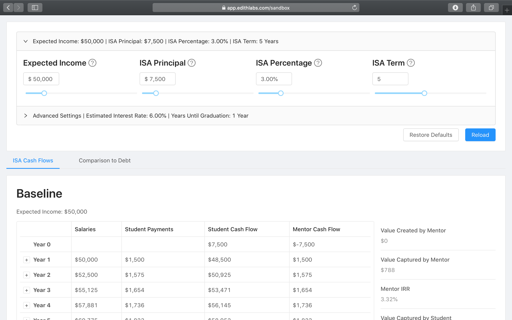
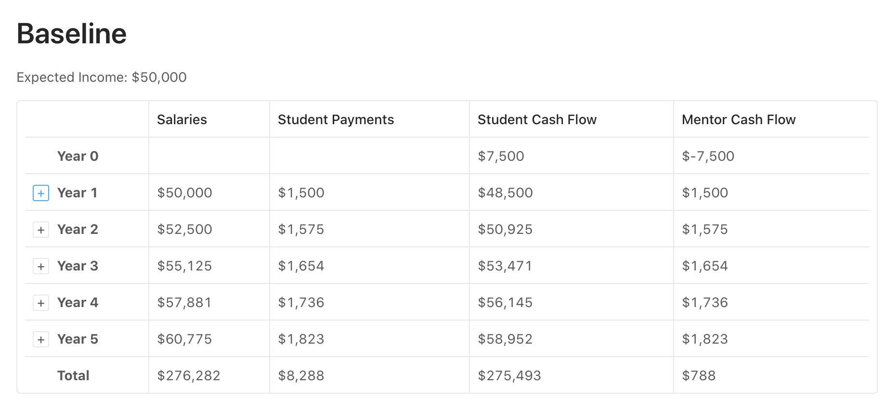
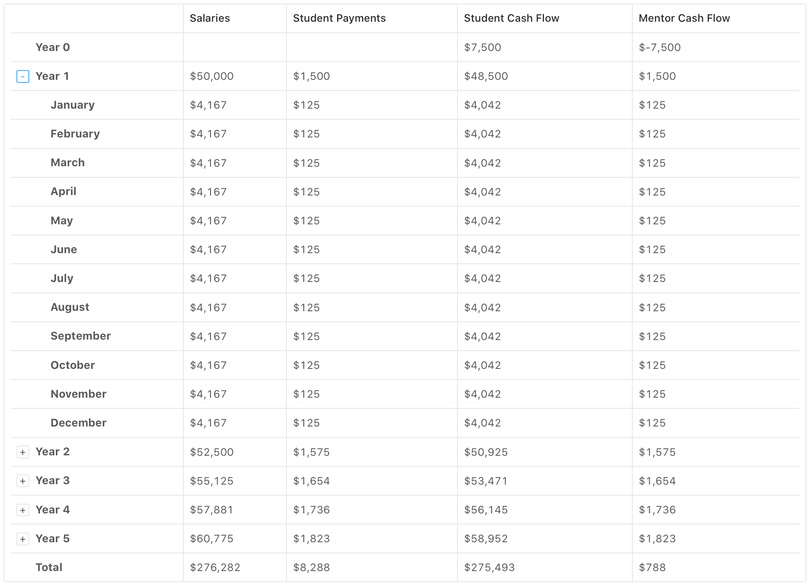
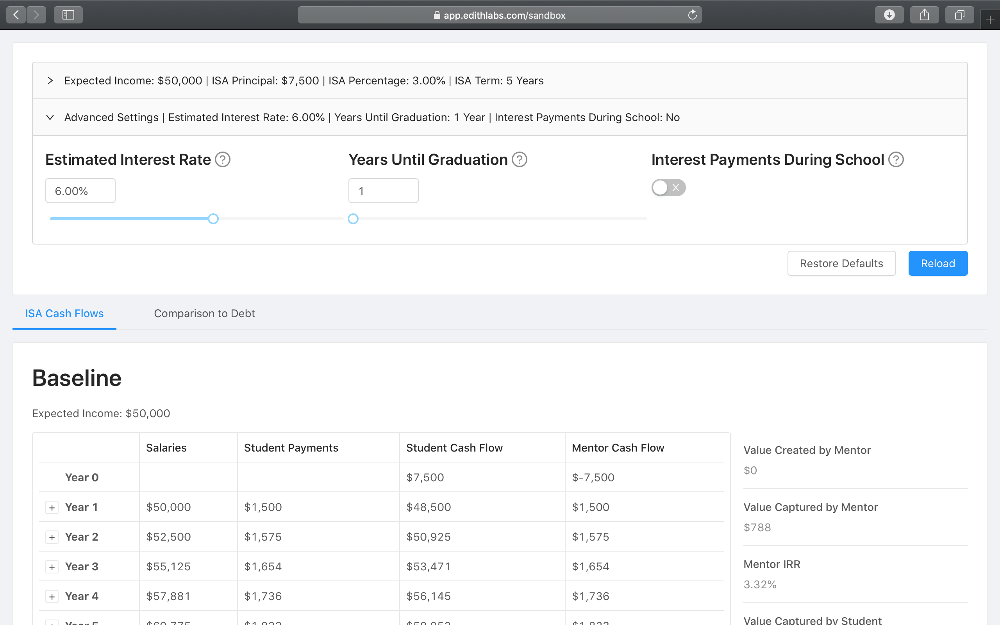
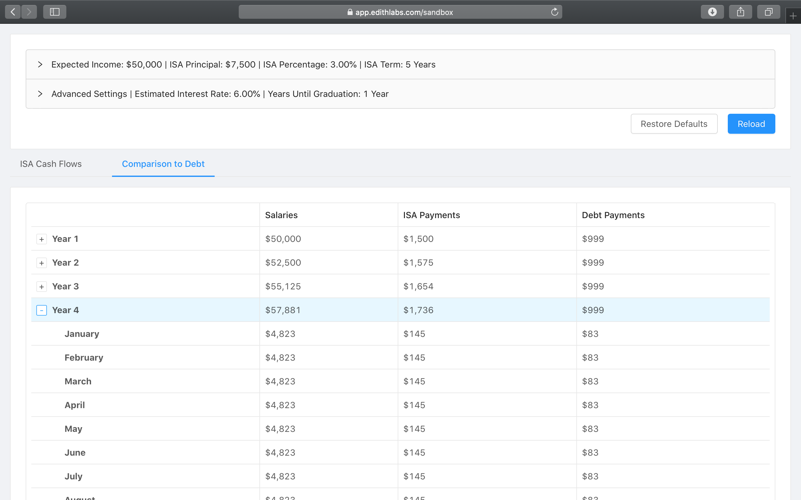
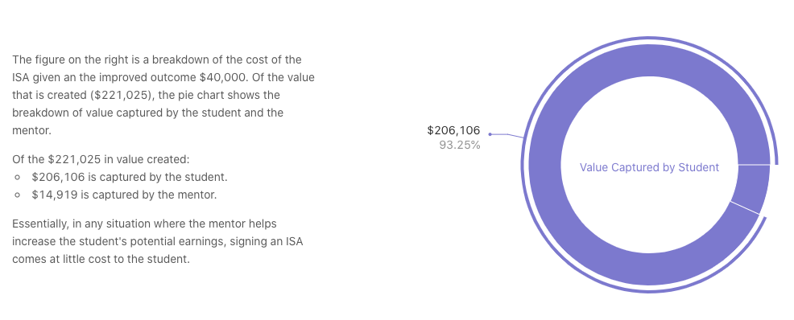

## Welcome to Edith's ISA Sandbox

As a new way of funding education, income share agreements (ISAs) are not well understood by the general public, especially with how they compare to traditional student loans.

We [built the ISA sandbox](https://app.edithlabs.com/sandbox) so mentors and students could better understand how an ISA works and transparently understand what payments they could expect to make and receive.

An ISA has four basic parameters necessary to calculate these cash flows.
* **Expected Income:** The best approximation of a student's income post-graduation given the information that you know. As we build out the platform and gather more data points, we'll work closely with students to best approximate this number so they have an estimate of how much they could owe by opting to fund their education with an ISA.

* **ISA Principal:** The amount you need to pay for tuition and/or living expenses. Generally, this is the amount of need that is not met once you have maximized your allotment of public student loans. It is generally much easier to construct a favorable ISA for a student when compared with private student loans with high interest rates.

* **ISA Percentage:** When you pay back the ISA, the percentage of your income that you will be paying back. This percentage is usually determined by comparing it to average student loan interest rates and a student's expected income and finding a percentage that approximates the total loan payments you would make.

* **ISA Term:** The number of years you will be making the payments. While debt usually has a term of 10 years, our ISAs will have a term closer to 5 years to repay our mentors faster and also allow students to keep more of their income as their career growth accelerates.

Setting the basic ISA parameters allow us to construct the cash flows for a given student outcome. The constructed table has the estimated salaries for the student, their total payment for the year as well how much they'd make as a result, and the cash flow the mentor would receive.

We can also break down the yearly payment to see the monthly cash flows for both the student and investor a student would make.

The focus however, is on the outcomes. We define 4 key metrics to evaluating the outcome of an ISA.

* **Value Created by Mentor:** This is the income increase over the expected baseline income over the life of the ISA. Because we believe that student outcomes are highly variable, mentors can help students improved upon their expected outcome by giving students access to their network, providing them career advice, and helping them with recruiting.

* **Value Captured by Mentor:** The share of the value created that the mentor shares in. The more value the mentor helps create, the more value they share in, so incentives are aligned with the student.

* **Mentor IRR:** The internal rate of return (IRR) is a measure of the return on investment discounted by time. Since it takes time for the student to repay their ISA, the IRR gives a mentor a good gauge of the returns they can expect.

* **Value Captured by Student:** The share of the value the mentor helps create that the student gets. This is value that is created in excess of the expected outcome.

These 4 metrics summarize the value we believe Edith brings to both students and mentors: students leverage their potential to get help from mentors who help create shared value for their successes.

The ISA tool allows you to model the value created for different student outcomes. It sets the first scenario as the baseline outcome and compares subsequent scenarios to that baseline.

## Advanced Settings

Because ISAs can get complicated fast, we hide some toggleable parameters under "Advanced Settings". These are the currently available settings:

* **ISA Payment Cap:** This is the maximum amount of money a student could repay on their ISA. It doesn't matter if you make $200,000 a year, if your payback cap is 2.0x for a $10,000 ISA the most you would have to repay is $20,000.

* **Estimated Interest Rate:** If you were to take out debt, the estimate interest rate for your loan payments. The interest rate for public student loans is 4.53% while the average interest rate for private student loans is 7.64%. For more details on student loan interest rates, check out our post [What are Student Loans?](/what-are-student-loans)

* **Years Until Graduation:** Number of years until student graduates. For example, a senior would be 1 year from graduation and a sophomore would be 3 years from graduations. This determines how long it will take for the mentor to start seeing repayments on the ISA principal.

* **Interest Payments During School:** Depending on the type of student loan, the student may owe interest payments during school. Toggling this setting on indicates the interest payments you would have to make during your time in school. Generally, the only types of loans that defer interest payments until after graduation are subsidized public loans and specific private loans where this condition is agreed upon when issuing the loan.

We plan on expanding the flexibility of the tool by expanding the set of advanced settings over time to better model different student situations and types of ISAs.

## Comparing an ISA to Debt

The ISA sandbox allows you to directly compare the cost of an ISA to the cost of a student loan. While it is hard to compare the cash flows directly if the ISA term and student loan are not the same, you can compare the total payments to understand cost for a student.

For student loans with high interest rates, it is easy to construct an ISA with favorable terms for the student. Because the ISA is more than just a transfer of capital, Edith believes that ISAs make sense for students that need to take on private student loans with higher interest rates.

## Visualizations/charts

We've included charts to help visualize the payments at the bottom of the sandbox.

We come up with an expected salary by taking into consideration a student's personal experiences, school, and intended career path. We consider any improvement above this expected outcome as value created for the student. Part of this value is shared with the mentor. 

This breakdown varies based on the ISA percentage, which you can adjust in the tool.

## Future Development

The ISA Sandbox is still in it's infancy and we'll continue to iterate and build out features as we go along.

Some upcoming features:
* More advanced settings (minimum salary)
* Ability to save scenarios and import to Edith platform
* Export sandbox as a PDF report

If you have any bugs to report or feature suggestions, please contact me at [kevin@edithlabs.com](mailto:kevin@edithlabs.com). You can find a [link to the sandbox here](https://app.edithlabs.com/sandbox).