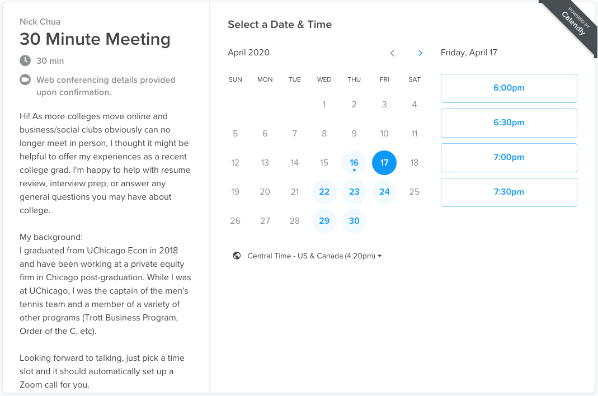
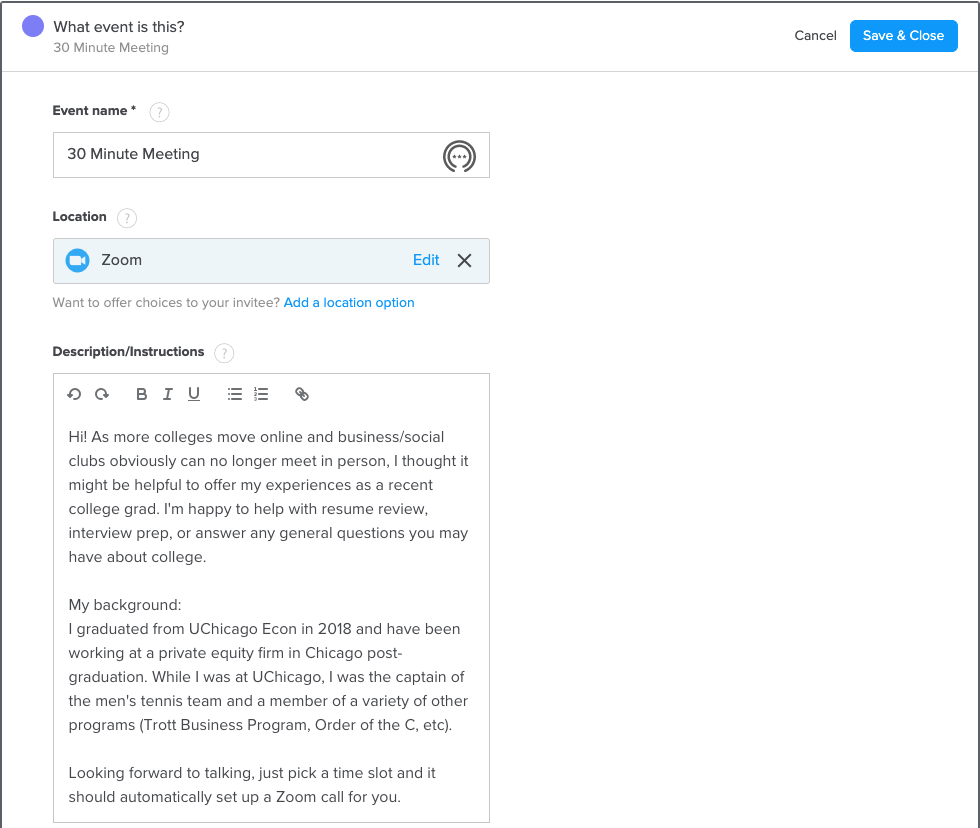
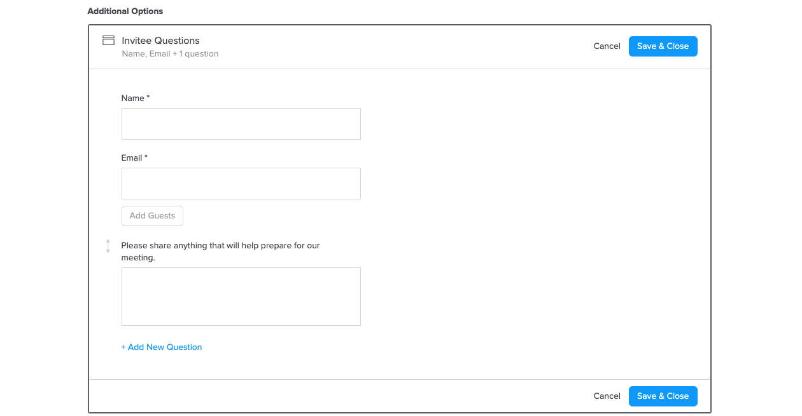
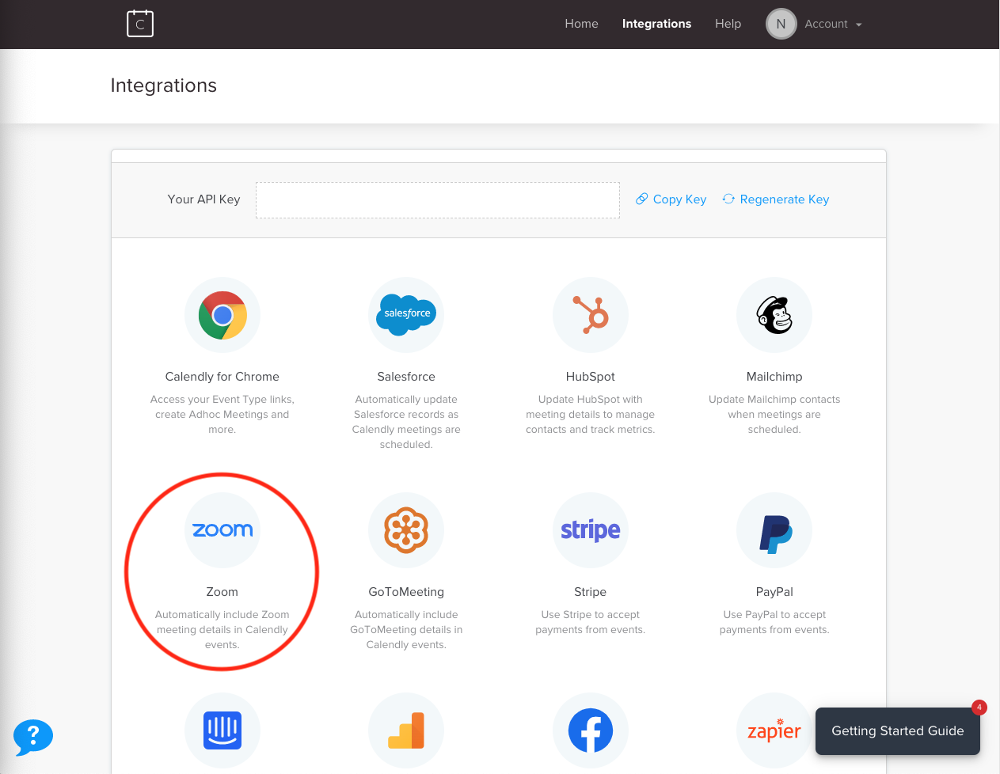

There are two types of student requests for help on Edith - a public request that all mentors can see, and a private request from one student to a specific mentor. As a mentor on the platform, you can choose to answer any requests on your own time. If a student sends you a private request, you'll have the option to decline or accept it. We, and the students, appreciate any help you can give. 

There are many ways to be a great mentor on Edith, but there are steps you can take to be more effective. We’ve compiled our five top tips below - they range from making more approachable profiles to easier methods of setting up meetings. 

**Step 1: Use tags effectively**

Tags are extremely important on the platform - they power our recommendation engine and our mentor match scores. If you’re a generalist that has done many types of jobs, feel free to put all the tags that apply. However, the more specific you can be, the better matches you’ll have with students. Your tags will also automatically filter your feed of requests, so you’ll only see requests from people looking for help in your tags. 

You can change your tags anytime in settings under ‘Edit Profile.’

**Step 2: Humanize your bio**

The best bios tell students your professional experience _and_ your personal interests. It’s easier for a student to connect with a mentor with similar interests because they won’t have the same work experience yet. There’s no perfect length for a bio on Edith – we want you to write whatever is natural for you – but including interests outside of work is one of the best ways to connect with students.

For instance, this is my bio on the platform. 

>Hi, I’m Nick. I studied Economics at the University of Chicago and played on the Men’s Tennis Team all four years. I’m passionate about esports, tech, and entrepreneurship. I’m also a big Star Wars and Lord of the Rings fan - always happy to talk about anything science fiction or fantasy related. I’ve worked in private equity at Inoca Capital Partners and was part of the Trott Business program at UChicago.

**Step 3: Use a good picture**

While they may not be worth a thousand words, a good picture is at least as important as having a strong bio. It doesn’t necessarily need to be a professional picture, but one that clearly shows your face helps students relate.

**Step 4: Use Calendly to set up meetings**

Scheduling meetings with students can be annoying because you have to give times where you’re free, they have to match it with times they’re free, then you need to confirm it still works for both of you. Skip the hassle by [using Calendly](https://calendly.com/), a free service that allows for easy scheduling.

You can send a student a link to your Calendly and it will display your pre-selected times where you’re available, and you can schedule right through the app. For instance, if a student wanted to schedule time with me they would simply click on [this link](https://calendly.com/nicktchua/30min) and see the following page. 

Calendly can also integrate with Zoom, which means every time a student confirms a time slot it will automatically both send you a Zoom invite for that date/time. This is extremely useful for both sides, so we’d highly recommend a Zoom integration. We will walk through how to set up Calendly, Zoom, and the integration below if you’re unfamiliar with the steps necessary.

**Step 5: How to respond when you can’t help a student**

While we want to help students with as many requests as possible, there will be times where they may ask you for help with something you’re uncomfortable offering. For instance, a student may ask you for a referral to your company and you don’t know them well enough yet. In this instance, it’s completely acceptable to let them know you aren’t comfortable with the current request at the moment. 

Also, we completely understand if you don’t have enough time to get to every student’s request. You can be as active or inactive on the platform as your schedule permits - we and the students appreciate any help you can give. 

We do ask that you communicate your rational, as well as potential alternative steps. If a student is asking for a referral and you don’t know them well enough to offer one, you could tell them that you’d like to get to know them first and offer a 30 minute chat as a starting point. If you’re uncomfortable with offering referrals at all, that’s totally fine too – but please let the student know. 

Helping them prepare for interviews or reviewing their resume for your company is invaluable help they couldn’t find elsewhere, so offering that up instead should be enough. If students continue to pressure you in ways that makes you uncomfortable please email us at [support@edithlabs.com](mailto:support@edithlabs.com) and we’ll talk it over with them. 

We hope this was helpful - if you have any questions on how to implement what we talked about above, we’ve walked through the setup below. 

## Tell me more

### How do I set up a Calendly?

You first have to set up your account on [their website](https://calendly.com/). It’s completely free, so you don’t have to worry about entering a credit card or being charged in the future. Using sign-in with Google is the easiest way to sign up. 

Once you sign up through the Google sign-in, you can create your own Calendly url which you’ll use to share in the future. For instance, my link could be calendly.com/nickchua (not my real link). You can then set up the type of meetings you want to have. You can only choose one type of meeting with a free account, so you’ll see that I’ve chosen a 30 minute meeting below. 

Once you’ve chosen the type of meeting, you can add a description and location for the meeting. My description gives a short background of myself and the purpose of the meeting. You’ll note that I’ve also chosen Zoom as the location, and we’ll go over Zoom integration in the section below. 

Finally, you can choose what information you want from meeting participants when they sign up in the ‘Additional Options’ section. I’ve chosen to ask for a name, email, and a short description because I’d like to be able to prep for the meeting within my calendar. You can always customize these questions to whatever works for you. After setting up these parts, and integrating Zoom, you should be ready to go! 

### How to integrate Zoom

First you’ll need a Zoom account, and if you don’t already have one you can [sign up here](https://zoom.us/). Once you have an account, it’s really simple to integrate. Simply click on the ‘Integrations’ button in the navigation bar on Calendly and select Zoom.

Now when anyone signs up for a slot on your calendar it should automatically send a Zoom link to both parties and link to your calendars. 

That’s all you need to do to set up your own Calendly and Zoom. Thanks for being a mentor on Edith! 