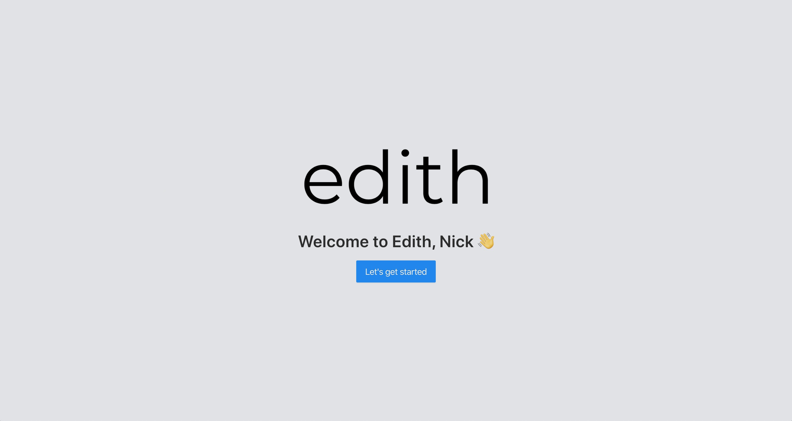
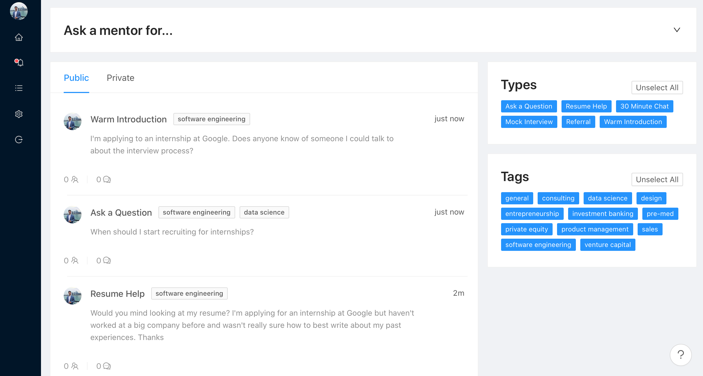
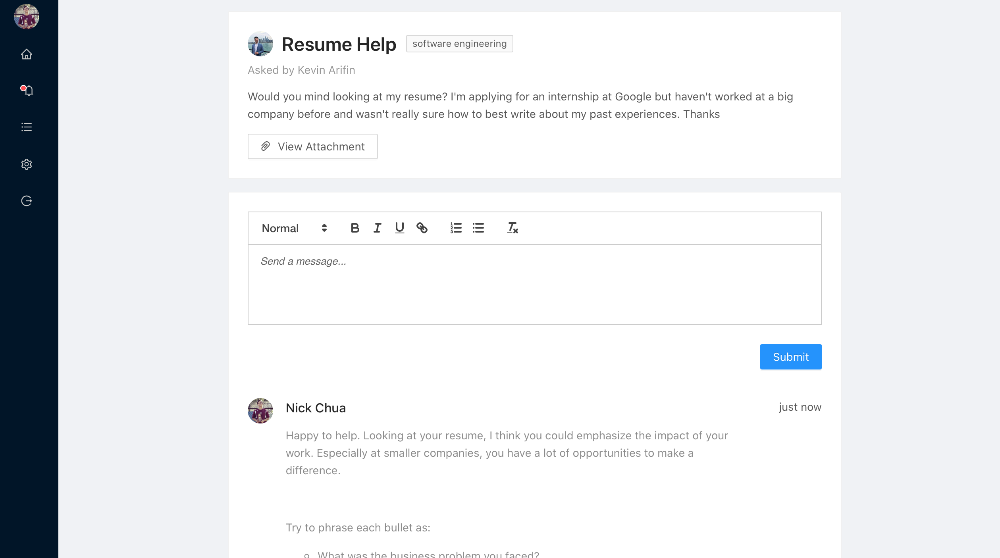

Getting through college is difficult. For years, students have turned to classmates, teammates, clubs, and others for advice. But as more and more colleges go remote, many of these resources disappear. We’re committed to helping students receive the guidance and mentorship necessary to succeed.

Today, we’re excited to announce the first launch of Edith – a place where students can connect with mentors online. Students on the platform can either make requests to the general population of mentors or they can make one-on-one requests to specific mentors. Right now, we support the following requests on the platform:

* General questions
* Resume help
* 30 minute chats
* Mock interviews
* Referrals
* Warm introductions

Our Edith experience is built to foster active relationships and conversations between individual students and mentors. We want to maximize the quality of interactions, not the quantity. We know you can post requests for help on places like Reddit or Quora, but you can never be sure of the quality of responses you’ll receive. Our mentors can help answer questions from a variety of industries – they come from companies like Apple, Citadel, Morgan Stanley, and McKinsey. If you have school-specific questions, our mentors come from schools like UChicago, UC Berkeley, UCLA, and Stanford Med School.

Not only will each mentor be verified before being allowed on the platform, we’ll also have a mentor leaderboard. Students can rate responses from mentors as helpful or unhelpful, and mentors will receive a varying number of points depending on what type of request they answered.

While our goal of launching a platform to help students pay for college by connecting them to mentors through income share agreements (ISAs) hasn’t changed, we’ve decided to start with this platform in particular because of the lower barrier of entry. Students don’t need to sign ISAs, and mentors don’t need to pledge capital to start. We’re totally focused on cultivating productive relationships, and will take what we learn from this platform to help inform the launch of the next platform.

We’re really excited for this launch, and hope you join us on Edith. We’re limiting the number of students in the beginning to ensure quality, but if you’re a student interested in using our platform please sign up for the waitlist [here](/waitlist). If you’re an interested potential mentor, please email us at [mentor@edithlabs.com](mailto:mentor@edithlabs.com) and we’ll follow up within a day. See you soon!

